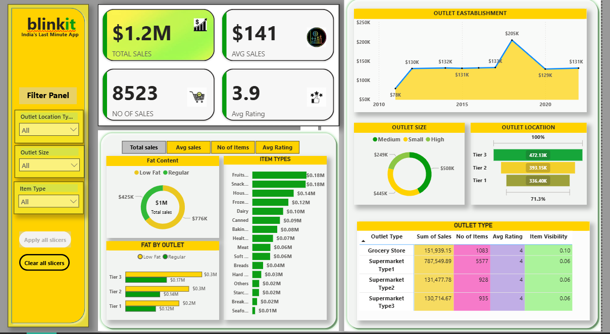

# BlinkIT Order Summary Dashboard 📊

### 🚀 Overview  
This Power BI dashboard provides an **insightful summary of BlinkIT orders** for a particular city. It helps analyze order trends, customer behavior, and delivery performance.

### 🔹 Key Features  
✔ **Total Orders & Revenue** – Track order volume and earnings.  
✔ **Order Trends & Status Breakdown** – View delivered, canceled, and pending orders.  
✔ **Top-Selling Categories & Products** – Identify best-performing items.  
✔ **Delivery Performance Metrics** – Analyze delivery time & efficiency.  
✔ **Payment Mode Analysis** – Compare COD vs. Online Payments.  
✔ **Geographical Insights** – Heatmap of orders by PIN code.  

### 📊 Built Using  
- **Power BI** – Data Visualization  
- **DAX & Power Query** – Data Processing  
- **Excel/SQL** – Data Source  
  
📂 **Dataset:** 

📂 **Snapshot:** 
